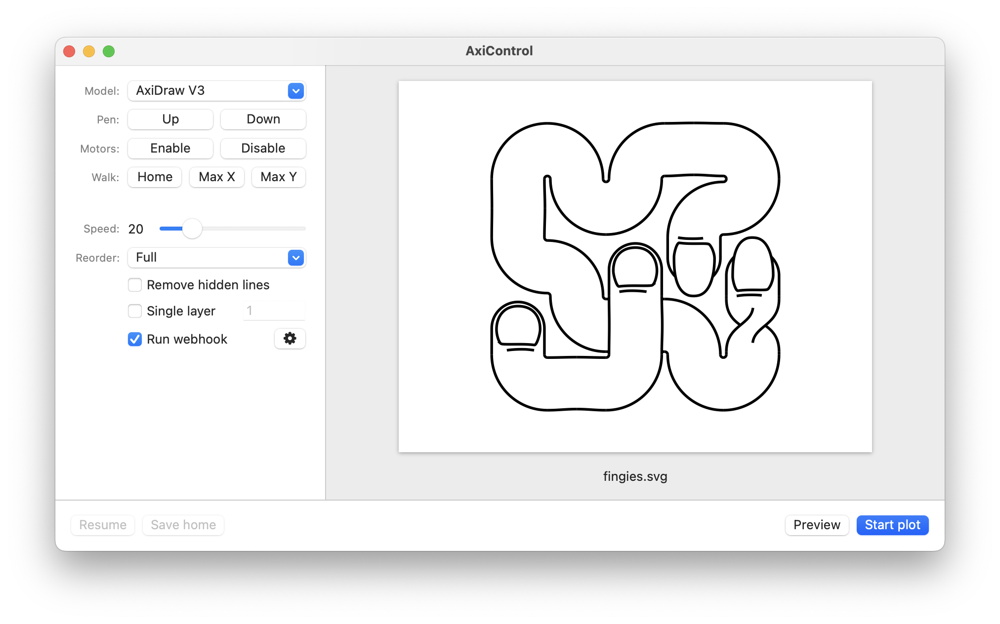

# AxiControl

A Mac GUI for the [AxiDraw Command Line Interface](https://axidraw.com/doc/cli_api/).

## Installation

### 1. Install the AxiDraw CLI

This app sends commands to AxiDraw through the AxiDraw CLI, so the CLI must be installed in order for the app to work.

The app expects the CLI to be installed at `/usr/local/bin/`.

One line install:  
`python -m pip install https://cdn.evilmadscientist.com/dl/ad/public/AxiDraw_API.zip`

See the full installation instructions on [AxiDraw.com](https://www.axidraw.com/doc/cli_api/#installation).

### 2. Download AxiControl

Download the [`AxiControl.zip`](https://github.com/cadin/axi-control/releases/latest/download/AxiControl.zip) file from the [Releases](https://github.com/cadin/axi-control/releases/) page.

Unzip and move the app to your Applications folder.

### 3. Authorize the app

This app isn't currently being notarized by Apple. This means you'll get a security warning when trying to launch the app for the first time ([more info here](https://support.apple.com/guide/mac-help/open-a-mac-app-from-an-unidentified-developer-mh40616/mac)).

To launch the app, Control-click (or right-click) the app and choose **Open**. Choose **Open** again from the dialog.

#### Sequoia

In Sequoia this process is even more restrictive.

When you launch the app you'll see a dialog that says '"AxiControl" Not Opened', with no option to open it anyway.

Go to **Settings > Privacy and Security** and you should see a message that says "AxiControl" was blocked to protect your Mac'. Click **Open Anyway**, then choose **Open Anyway** from the dialog.

You can open the app normally by double-clicking after completing this process.

## Features

### Plot & Resume

Drag an SVG onto the app window and choose **Start plot** to start plotting.

A temp file will be created to save plot progress. Pause the plot with the hardware button, and choose **Resume** to continue plotting where you left off.

You can also choose **Save home** when paused. This will move the carriage to the home position and save the move to the temp file. Choosing **Resume** after **Save home** will resume the plot from the home position.

### Walk the carriage

**Home** moves the carriage to the home position.

**Max X** and **Max Y** moves the carriage to the maximum plot dimensions. This can be useful to ensure your paper is squarely aligned before beginning a plot.

**Be sure you have your correct AxiDraw model selected**. Otherwise you may damage your device by walking it outside the maximum range.

### Speed control

The Speed slider controls the speed limit for the XY carriage when the pen is down. This value is expressed as a percentage of maximum travel speed.

### Layers control

Specify a number which indicates which layer (or layers) will be plotted when plotting in layers mode. See the [AxiDraw CLI docs](https://www.axidraw.com/doc/cli_api/#layer) for more info.

Note: Layers are not a native feature of SVG. You probably have to create your SVGs in Inkscape to create files with usable layer numbers.  
See _[Adding layers outside of Inkscape](https://wiki.evilmadscientist.com/AxiDraw_Layer_Control#Adding_layers_outside_of_Inkscape)_ on the EMS wiki.

### Webhooks

Run a webhook when your plot completes. You can easily set up a webhook at [IFTTT](https://ifttt.com/maker_webhooks) to send you a notification when your plot completes.

Click the gear to enter the URL for your webhook.

## Support

If you encounter a problem please file an issue.  
This is a small personal project that is mostly unsupported.

### Troubleshooting

#### Error: "Error sending command"

This most likely means you haven't installed the AxiDraw CLI properly. Try sending a command from the terminal to verify the installation.

The app expects the CLI to be installed at `/usr/local/bin/`.

#### Error: "Failed to connect to AxiDraw."

The CLI couldn't connect to your AxiDraw.  
Make sure the USB cable is connected to the AxiDraw and your Mac.

#### AxiDraw makes a horrible grinding noise

This happens when a command tells the AxiDraw to move outside of its maximum plot area.  
Make sure you have the correct AxiDraw model selected.

You may also run outside the maximum bounds by invoking Walk Max X or Y from an offset starting location.
